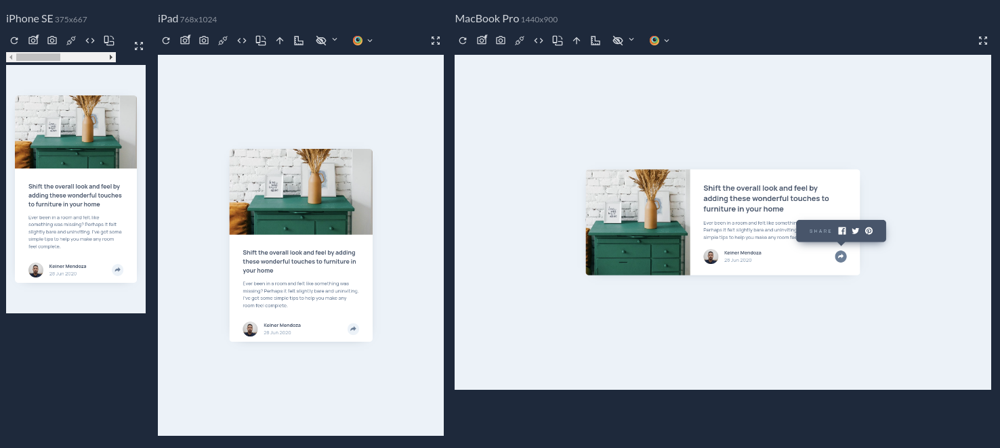

# Frontend Mentor - Article preview component solution

This is a solution to the [Article preview component challenge on Frontend Mentor](https://www.frontendmentor.io/challenges/article-preview-component-dYBN_pYFT). Frontend Mentor challenges help you improve your coding skills by building realistic projects. 

### Screenshot

### Links

- Solution URL: [Available on Frontend Mentor](https://www.frontendmentor.io/solutions/article-component-in-react-that-dosent-require-using-react-ymIh7lynQy)
- Live Site URL: [Hosted on Vercel](https://fm-article-eight.vercel.app/)

## My process

### Built with
- React
- Semantic HTML5 markup
- CSS custom properties
- Flexbox
- CSS Grid
